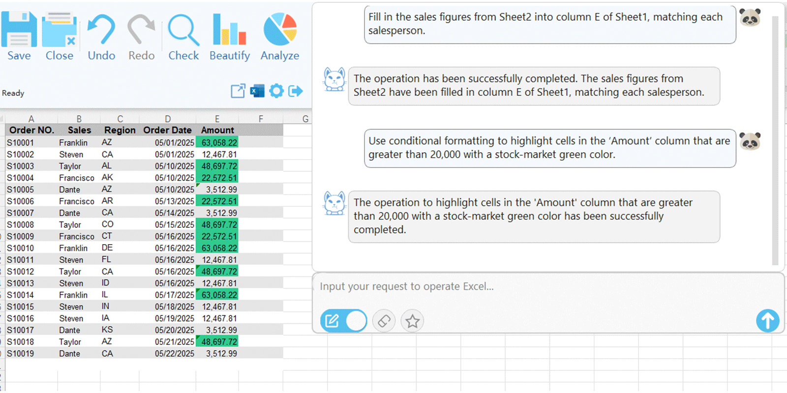

# GiGiGrid — Smart Assistant for Excel

**GiGiGrid** is a powerful AI-driven assistant for Excel users. It helps you process data more efficiently, automate repetitive tasks, and boost your productivity in spreadsheets.

👉 Product Website: https://gigigrid.com/

## ✨ Key Features

- ✅ Natural language Excel operations driven by AI,LLM
- ✅ Intelligent auto-fill, merge, and data completion
- ✅ AI-powered Excel formula generation
- ✅ Local processing: **no cloud upload**, full data privacy
- ✅ Visualized chart analysis
- ✅ Upload and edit your Excel files online

## 🎯 Who Is It For?

- Office workers using Excel daily
- Data analysts, administrative, and financial staff
- Users who are unfamiliar with formulas but need powerful automation

## 🚀 How to Use

We highly value your data privacy and user experience. By using the desktop application, all processing is done locally, with no data being uploaded to the cloud. This ensures greater security and a smoother experience.
- Windows desktop app: https://gigigrid.com

## 🚫 Source Code

This repository is for introduction and documentation only. The source code is **not open-sourced** at the moment. For partnership inquiries, please visit our official site.

## 📷 Demo Screenshots

> 

> 

> 

---

Explore more features and tutorials on our [website](https://gigigrid.com/)!
