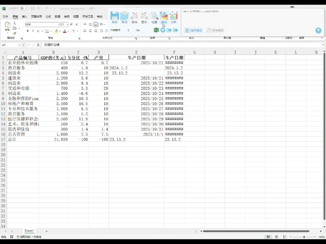
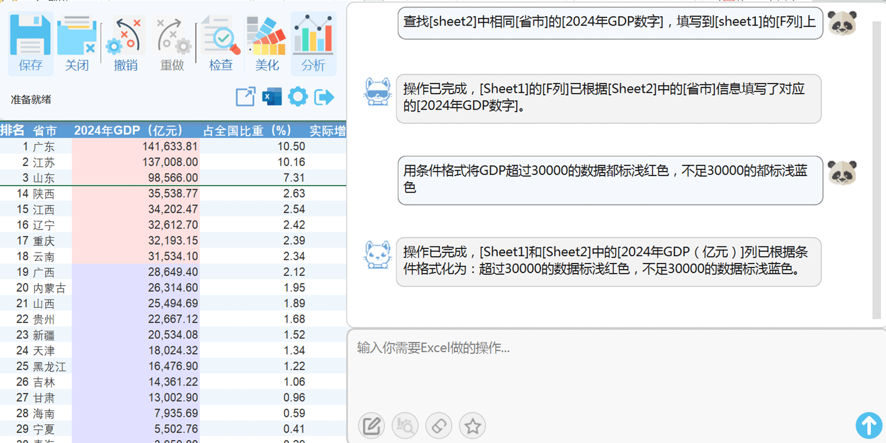
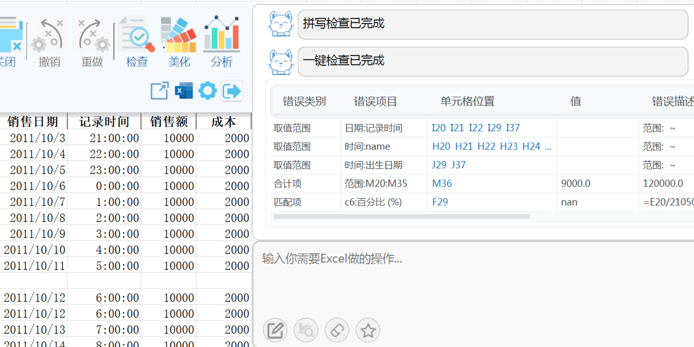
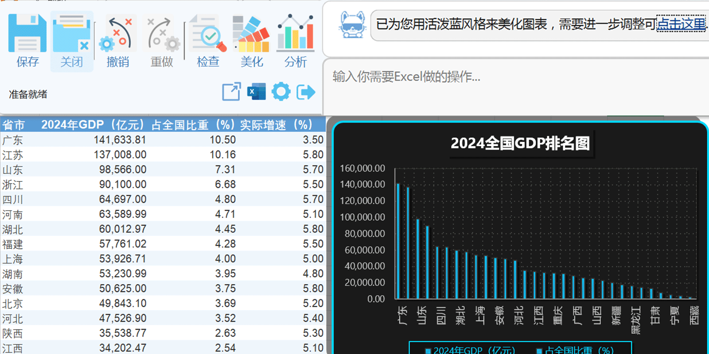

# GeGeBlue —— Excel 智能助手

GeGeBlue (海外版GiGiGrid)是一款强大的 Excel 智能助手，致力于帮助用户更高效地处理数据、自动化表格操作、提升办公效率。无论是复杂公式、数据清洗，还是批量处理、智能补全，GeGeBlue 都能轻松应对。

👉 官网地址：[https://gegeblue.com.cn](https://gegeblue.com.cn?utm_source=github&utm_medium=home) 海外版地址：[https://gigigrid.com](https://gigigrid.com?utm_source=github&utm_medium=home)

## ✨ 核心功能

- ✅ 支持中文语义操作 Excel
- ✅ 智能填表、补全、合并
- ✅ AI 智能生成 Excel 公式
- ✅ 所有处理均在本地完成
- ✅ 可视化图表分析
- ✅ 支持上传本地 Excel 文件处理

## ▶️ 产品展示

## 🎯 适用人群

- 日常使用 Excel 的白领办公人员
- 数据分析师、行政人员、财务人员
- 不懂公式但需要高效操作 Excel 的用户

## 📌 使用方式

我们非常重视您的数据隐私与使用体验。使用桌面版应用，所有处理均在本地完成，数据不会上传至云端，从而为您提供更高的安全性和更流畅的操作体验。
- Windows 桌面版：https://gegeblue.com.cn
- Web 在线体验：https://gegeblue.com.cn/handle
- 微信小程序 搜索：**GeGeBlue**

## 📷 部分截图

> 

> 

> 

## 🚫 源码未公开

本仓库仅用于产品介绍和使用说明，暂未公开源代码。如有合作意向，请联系官网客服。

---

欢迎[访问官网](https://gegeblue.com.cn?utm_source=github&utm_medium=home)了解更多功能和体验案例。

